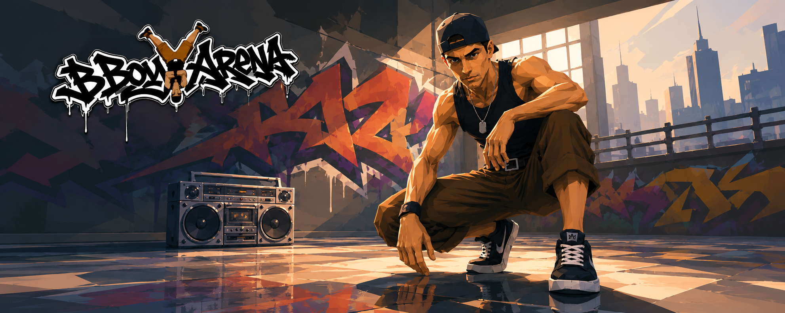

# BboyArena.org



**BboyArena is an early-stage breaking culture project with a street-inspired visual identity and a browser-first future.**

A public work in progress built to grow with the community.

## What is BboyArena?

BboyArena is a project about breaking culture, creative movement, and the world around it.

Right now it includes:
- the public website;
- the project identity and manifesto;
- the legal and governance foundation;
- the first technical shell of the game.

It is not yet a playable prototype.

## Why it exists

BboyArena is being built to become:
- a place for breaking fans and street culture;
- a browser-based 3D game experience;
- a community-driven project with a strong visual identity;
- a public development story people can follow from the beginning.

## Current status

BboyArena is currently early / pre-0.0.1.

What exists today:
- public website;
- identity and editorial direction;
- game shell and UI experiments;
- placeholder scenes and technical groundwork;
- documentation for the future architecture.

What does not exist yet:
- a complete gameplay loop;
- a character controller;
- a battle system;
- a scoring system;
- multiplayer;
- a finished playable release.

## Project direction

The project is being shaped around:
- a strong street-level visual language;
- a browser-first experience;
- a clean public surface for updates;
- a community-driven identity;
- a space where development, culture, and marketing can grow together.

## How to interact with BboyArena

If you want to contribute, collaborate, or understand the rules of engagement, start here:

- [legal/CONTRIBUTING.md](./legal/CONTRIBUTING.md)
- [legal/GOVERNANCE.md](./legal/GOVERNANCE.md)
- [legal/LICENSE-SCOPE.md](./legal/LICENSE-SCOPE.md)
- [legal/COMMERCIAL-USE.md](./legal/COMMERCIAL-USE.md)
- [legal/TRADEMARKS.md](./legal/TRADEMARKS.md)
- [legal/SERVER-CERTIFICATION.md](./legal/SERVER-CERTIFICATION.md)

## Support the project

If you want to follow or support BboyArena:
- star the repository;
- watch the repo for updates;
- share it with people who care about breaking, street culture, or indie browser games;
- join the Discord when available;
- send feedback on the identity, wording, and direction;
- report anything that feels unclear or broken.

## Roadmap

The roadmap is intentionally high level.

1. Public presence
- keep the website stable;
- make the project easy to follow;
- publish clear progress updates.

2. First playable foundation
- define the first MVP scope;
- establish the gameplay loop;
- validate controls and camera flow.

3. PWA and updates
- ship an installable experience when ready;
- use the PWA as a lightweight update channel;
- surface version changes and new content clearly.

4. Community and growth
- strengthen the Discord and social loop;
- gather feedback from real users;
- share devlogs, notes, and future plans.

## Short copy

- **An open project for breaking fans, creative movement, and indie browser game development.**
- **A public work in progress built to grow with the community.**
- **An early-stage breaking culture project with a street-inspired visual identity and a browser-first future.**

## Marketing assets

- Banner: `apps/website/public/readme-banner.png`
- App icon: `apps/website/public/icon.png`
- PWA icons: `apps/website/public/android-chrome-192x192.png`, `apps/website/public/android-chrome-512x512.png`

## Local development

```bash
npm install

# Run the website on 4321
npm run dev

# Run the website + game
npm run dev:all

# Run the game standalone on 4322
npm run game:dev

```